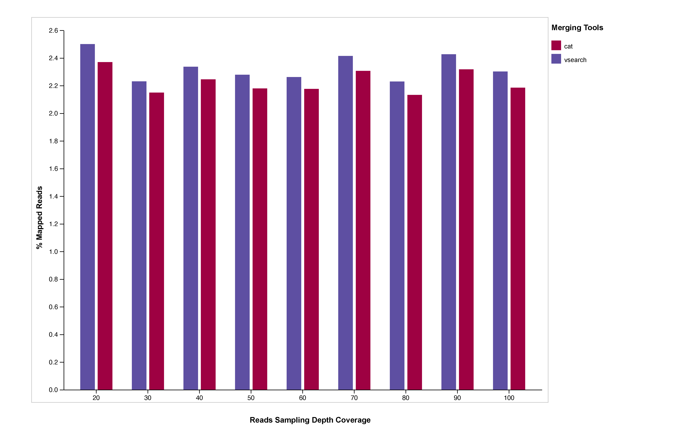

## read-merging

The objective of this analysis is to compare merging of NGS reads using `cat` and `vsearch`.

## Resources

- https://drive5.com/usearch/manual9.2/merge_pair.html
- https://drive5.com/usearch/manual9.2/cmd_fastq_mergepairs.html

## Required software

- vsearch (https://github.com/torognes/vsearch) or usearch (https://drive5.com/usearch/)
- RGI (https://github.com/arpcard/rgi)

## create the environment

```
conda env create -f envs/conda_env.yaml
```

or

```
mamba env create -f envs/conda_env.yaml
```

## activate the environment

```
# To activate this environment, use
#
#     $ conda activate read-merging
#
# To deactivate an active environment, use
#
#     $ conda deactivate
```

## command to merge two reads using `vsearch`

```
vsearch -fastq_mergepairs SampleA_R1.fastq -reverse SampleA_R2.fastq -fastqout merged.fq
```

## Example using simulated reads from (https://github.com/raphenya/read-mapping-analysis) at 20x coverage

```
vsearch -fastq_mergepairs data/JN420336_20x1.fq -reverse data/JN420336_20x1.fq -fastqout JN420336_20x_merged.fq
```

## Output from `vsearch`

```
# vsearch -fastq_mergepairs data/JN420336_20x1.fq -reverse data/JN420336_20x2.fq -fastqout JN420336_20x_merged.fq
vsearch v2.26.1_macos_x86_64, 64.0GB RAM, 16 cores
https://github.com/torognes/vsearch

Merging reads 100% 
     17810  Pairs
     17761  Merged (99.7%)
        49  Not merged (0.3%)

Pairs that failed merging due to various reasons:
        34  multiple potential alignments
        15  alignment score too low, or score drop too high

Statistics of all reads:
    150.00  Mean read length

Statistics of merged reads:
    199.56  Mean fragment length
      9.96  Standard deviation of fragment length
      0.25  Mean expected error in forward sequences
      0.33  Mean expected error in reverse sequences
      0.19  Mean expected error in merged sequences
      0.19  Mean observed errors in merged region of forward sequences
      0.23  Mean observed errors in merged region of reverse sequences
      0.42  Mean observed errors in merged region
```

## Results using `vsearch` and keeping not merged reads

```
vsearch -fastq_mergepairs data/JN420336_20x1.fq -reverse data/JN420336_20x2.fq -fastqout merged.fq --fastqout_notmerged_fwd notmerged_fwd.fq --fastqout_notmerged_rev notmerged_rev.fq

vsearch v2.26.1_macos_x86_64, 64.0GB RAM, 16 cores
https://github.com/torognes/vsearch

Merging reads 100% 
     17810  Pairs
     17761  Merged (99.7%)
        49  Not merged (0.3%)

Pairs that failed merging due to various reasons:
        34  multiple potential alignments
        15  alignment score too low, or score drop too high

Statistics of all reads:
    150.00  Mean read length

Statistics of merged reads:
    199.56  Mean fragment length
      9.96  Standard deviation of fragment length
      0.25  Mean expected error in forward sequences
      0.33  Mean expected error in reverse sequences
      0.19  Mean expected error in merged sequences
      0.19  Mean observed errors in merged region of forward sequences
      0.23  Mean observed errors in merged region of reverse sequences
      0.42  Mean observed errors in merged region

```

## Analysis with RGI for JN420336_20x_merged.fq (merged using `vsearch`) and results

```
rgi bwt -1 JN420336_20x_merged.fq -o output_merged1 -a kma --clean --local -n 20 > run1.log 2>&1 &

cat output_merged1.gene_mapping_data.txt | cut -f1,12,13
ARO Term	All Mapped Reads	Average Percent Coverage
catB3	36.00	94.79
QnrB17	13.00	32.16
NDM-1	62.00	100.00
QnrB1	38.00	91.94
Plasmid-encoded cat (pp-cat)	8.00	35.91
AAC(6')-Ib-cr1	26.00	90.63
AAC(6')-Ib11	3.00	9.65
OXA-1	62.00	100.00
CTX-M-15	62.00	100.00
BRP(MBL)	27.00	100.00
AAC(6')-Ib-cr3	17.00	37.00
AAC(6')-Ib-cr6	1.00	5.17
AAC(6')-Ib-cr7	3.00	39.28
catA1	41.00	100.00

```

## Analysis of unmerged reads

```
rgi bwt -1 notmerged_fwd.fq -o output_merged3 -a kma --clean --local -n 20 > run3.log 2>&1 &

rgi bwt -1 notmerged_rev.fq -o output_merged4 -a kma --clean --local -n 20 > run4.log 2>&1 &
```

Both did not align to any AMR gene in CARD using the cannonical sequences and CARD variants.

## Merging with `cat` command

```
cat data/JN420336_20x1.fq data/JN420336_20x2.fq > JN420336_20x_merged_using_cat.fq
```


## Analysis with RGI for JN420336_20x_merged_using_cat.fq (merged using `cat`) and results

```
rgi bwt -1 JN420336_20x_merged_using_cat.fq -o output_merged2 -a kma --clean --local -n 20 > run2.log 2>&1 &

cat output_merged2.gene_mapping_data.txt | cut -f1,12,13
ARO Term	All Mapped Reads	Average Percent Coverage
catB3	69.00	83.41
QnrB17	19.00	25.70
NDM-1	123.00	100.00
QnrB14	1.00	22.03
QnrB1	75.00	95.81
Plasmid-encoded cat (pp-cat)	16.00	33.94
OXA-1	122.00	100.00
CTX-M-15	120.00	100.00
BRP(MBL)	48.00	100.00
AAC(6')-Ib-cr3	26.00	31.33
AAC(6')-Ib-cr4	59.00	91.36
AAC(6')-Ib-cr6	3.00	5.17
AAC(6')-Ib-cr7	5.00	28.65
catA1	76.00	97.88
```

## Multiple runs for reads merged with `vsearch` command

Reads were simulated reads using https://github.com/raphenya/read-mapping-analysis pipeline at 20x, 30x,40x, 50x, 60x, 70x, 80x, 90x, and 100x coverage.
The reads were then merged using `vsearch` before running `RGI` to the merged file.

```
grep "Mapped reads" *overall_mapping_stats.txt
output_merged100x.overall_mapping_stats.txt:Mapped reads:      2044	(2.30141%)
output_merged20x.overall_mapping_stats.txt:Mapped reads:      444	(2.49972%)
output_merged30x.overall_mapping_stats.txt:Mapped reads:      594	(2.22981%)
output_merged40x.overall_mapping_stats.txt:Mapped reads:      830	(2.33553%)
output_merged50x.overall_mapping_stats.txt:Mapped reads:      1012	(2.27774%)
output_merged60x.overall_mapping_stats.txt:Mapped reads:      1205	(2.26058%)
output_merged70x.overall_mapping_stats.txt:Mapped reads:      1501	(2.41427%)
output_merged80x.overall_mapping_stats.txt:Mapped reads:      1584	(2.22929%)
output_merged90x.overall_mapping_stats.txt:Mapped reads:      1940	(2.42633%)
```

## mulitples runs for reads merged with `cat` command

Reads were simulated reads using https://github.com/raphenya/read-mapping-analysis pipeline at 20x, 30x,40x, 50x, 60x, 70x, 80x, 90x, and 100x coverage.
The reads were then merged using `cat` before running `RGI` to the merged file.

```
grep "Mapped reads" *_cat.overall_mapping_stats.txt
output_merged100x_cat.overall_mapping_stats.txt:Mapped reads:      3891	(2.18473%)
output_merged20x_cat.overall_mapping_stats.txt:Mapped reads:      844	(2.36946%)
output_merged30x_cat.overall_mapping_stats.txt:Mapped reads:      1148	(2.14861%)
output_merged40x_cat.overall_mapping_stats.txt:Mapped reads:      1599	(2.24453%)
output_merged50x_cat.overall_mapping_stats.txt:Mapped reads:      1940	(2.17855%)
output_merged60x_cat.overall_mapping_stats.txt:Mapped reads:      2324	(2.17481%)
output_merged70x_cat.overall_mapping_stats.txt:Mapped reads:      2875	(2.30609%)
output_merged80x_cat.overall_mapping_stats.txt:Mapped reads:      3037	(2.13153%)
output_merged90x_cat.overall_mapping_stats.txt:Mapped reads:      3713	(2.31643%)
```
## Plot



## Conclusion

Using the `cat` command to merge NGS reads overall produces lower mapping than when using `vsearch`.


## License

The source code is licensed under the MIT license, which you can find in
the LICENSE file.